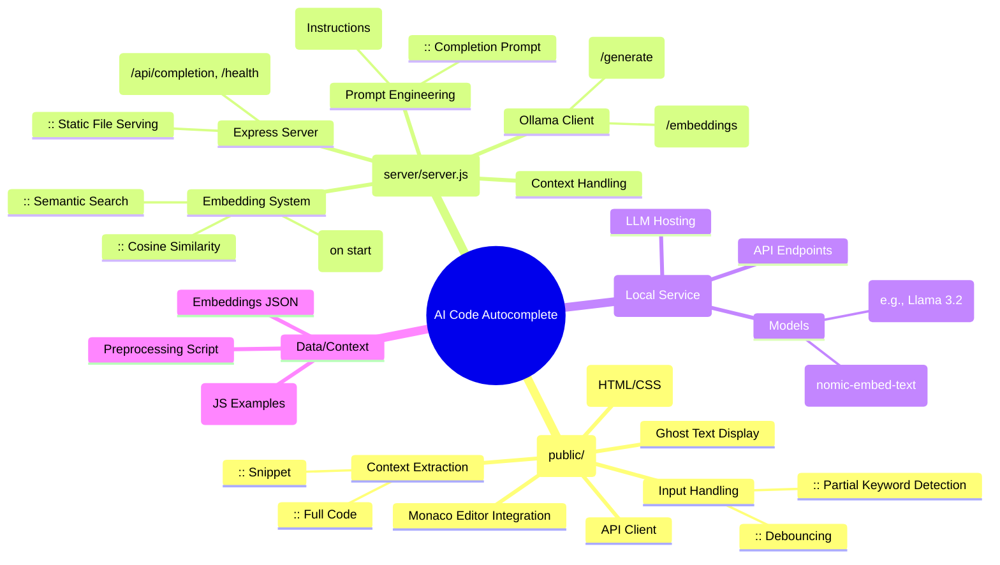

# Demo


https://github.com/user-attachments/assets/c0435dd0-5260-4479-82e9-20863e9c5a51


# AI Code Autocomplete System - Technical Documentation

## Table of Contents

- [System Architecture Overview](#system-architecture-overview)
  - [Core Components](#core-components)
- [System Design](#system-design)
  - [High-Level Diagram (Text-Based)](#high-level-diagram-text-based)
  - [Data Flow: Completion Request](#data-flow-completion-request)
  - [Component Interactions](#component-interactions)
- [Mind Map](#mind-map)
- [Technical Implementation Details](#technical-implementation-details)
  - [Frontend Implementation](#frontend-implementation)
    - [Monaco Editor Integration](#monaco-editor-integration)
    - [Ghost Text Rendering](#ghost-text-rendering)
    - [Debouncing & User Experience](#debouncing--user-experience)
    - [Partial Keyword Detection](#partial-keyword-detection)
  - [Backend Implementation](#backend-implementation)
    - [Express Server](#express-server)
    - [Ollama Integration](#ollama-integration)
    - [Embedding System](#embedding-system)
    - [Error Handling & Fallbacks](#error-handling--fallbacks)
- [Core Algorithmic Components](#core-algorithmic-components)
  - [Context Extraction & Snippet Generation](#context-extraction--snippet-generation)
  - [Code Structure Analysis](#code-structure-analysis)
  - [Semantic Search (Embeddings)](#semantic-search-embeddings)
  - [Prompt Engineering (Completion vs. Generation)](#prompt-engineering-completion-vs-generation)
  - [Completion Processing & Cleaning](#completion-processing--cleaning)
- [Hallucination Prevention](#hallucination-prevention)
- [Async Pattern Intelligence](#async-pattern-intelligence)
- [Supported Languages and Models](#supported-languages-and-models)
  - [Languages](#languages)
  - [LLM Models](#llm-models)
- [System Requirements](#system-requirements)
  - [Client](#client)
  - [Server](#server)
- [Performance Considerations](#performance-considerations)
  - [Latency Optimization](#latency-optimization)
  - [Memory Usage](#memory-usage)
- [Extension Points](#extension-points)
- [Security Considerations](#security-considerations)
- [Future Enhancement Paths](#future-enhancement-paths)

## System Architecture Overview

The AI Code Autocomplete system is a client-server application that provides intelligent code suggestions in real-time as users type. It leverages local LLM (Large Language Model) inference through Ollama for both code completion/generation and semantic context retrieval via embeddings, delivering low-latency, contextually relevant suggestions directly in a web-based Monaco editor.

### Core Components

1.  **Frontend Client (`public/`)**
    *   Web-based Monaco code editor (`app.js` integration).
    *   Handles user input, debouncing, partial keyword detection.
    *   Extracts code context and snippet around the cursor.
    *   Sends requests to the Backend API.
    *   Renders suggestions as ghost text.
    *   Loads static assets (HTML, CSS, JS, templates, context file).
2.  **Backend API Server (`server/server.js`)**
    *   Express.js server handling API requests.
    *   Communicates with Ollama for LLM inference (completion/generation and embeddings).
    *   Manages pre-computed context embeddings (`server/embeddings/`).
    *   Performs semantic search using cosine similarity.
    *   Constructs dynamic prompts based on request type (completion/generation) and semantic search results.
    *   Serves the frontend static files.
3.  **Ollama Service (Local)**
    *   Hosts and runs LLMs locally.
    *   Provides API endpoints (`/api/generate`, `/api/embeddings`).
    *   Requires specific models to be pulled (e.g., `llama3.2`, `nomic-embed-text`).
4.  **Context Embeddings (`server/embeddings/js_context_embeddings.json`)**
    *   Pre-computed vector representations of code chunks from `public/javascript_context.js`.
    *   Generated offline using `generate_embeddings.js` script and an embedding model (`nomic-embed-text`).
    *   Used by the backend for semantic similarity search.
5.  **Preprocessing Script (`generate_embeddings.js`)**
    *   Standalone Node.js script to read the context file, chunk it, generate embeddings via Ollama, and save them to the JSON file.

## System Design

### High-Level Diagram (Text-Based)

```
+-----------------+      +---------------------+      +----------------------+
| Frontend Client |----->| Backend API Server  |----->| Ollama Service       |
| (Monaco Editor) |      | (Express.js)        |      | (LLMs: Llama3.2,     |
| - Input Handling|<-----| - API Routes        |<-----|  nomic-embed-text)   |
| - Context Extract|      | - Ollama Interaction|      | - /api/generate      |
| - Ghost Text     |      | - Embedding Search  |      | - /api/embeddings    |
+-----------------+      | - Prompt Building   |      +----------------------+
                       |                     |
                       |        +-----------------------------+
                       |------->| Context Embeddings          |
                       |        | (js_context_embeddings.json)|      +-----------------------+
                       |        +-----------------------------+      | Preprocessing Script  |
                       |                                             | (generate_embeddings.js)|
                       |                                             +-----------+-----------+
                       |                                                         |
                       |        +-----------------------------+                      V
                       +------->| Context File                |<---------------------+ 
                                | (javascript_context.js)     |
                                +-----------------------------+
```

### Data Flow: Completion Request

1.  **User Input:** User types in the Monaco Editor (Frontend).
2.  **Debounce/Trigger:** `handleEditorContentChange` (Frontend) waits for a pause or detects a partial keyword.
3.  **Context Extraction:** `_extractContext` (Frontend) gathers the full file `code`, a `snippet` around the cursor, `language`, and editor state.
4.  **API Request:** Frontend sends a POST request to `/api/completion` (Backend) with `{ code, snippet, language, model }`.
5.  **Instruction Check:** Backend checks if the `snippet` is an instruction comment (e.g., `// write me...`).
6.  **Semantic Search (if not instruction):**
    *   Backend generates an embedding for the `snippet` using Ollama (`nomic-embed-text`).
    *   Backend compares this embedding against pre-loaded context embeddings using `cosineSimilarity`.
    *   Identifies the most relevant context `chunk` (if score > threshold).
7.  **Prompt Construction:** Backend builds `finalPrompt` based on:
    *   *Instruction Prompt:* If it was an instruction comment.
    *   *Completion Prompt:* Including `code`, `snippet`, and the relevant `chunk` (if found).
8.  **LLM Call:** Backend sends `finalPrompt` to Ollama's `/api/generate` endpoint using the specified completion model (e.g., `llama3.2`).
9.  **Response Processing:** Backend receives the raw completion, cleans it (removes markdown, potentially trims snippet prefix if not instruction).
10. **API Response:** Backend sends the `processedResponse` back to the Frontend.
11. **Display:** Frontend receives the completion and displays it as ghost text using `displayGhostText`.
12. **Acceptance:** User presses Tab, `acceptCompletion` inserts the ghost text into the editor.

### Component Interactions

*   **Frontend <-> Backend:** Standard HTTP API calls (POST `/api/completion`, GET `/api/health`, etc.). Frontend sends code context/snippet, backend returns completion text.
*   **Backend <-> Ollama:** HTTP API calls to Ollama's endpoints (`/api/generate` for completion, `/api/embeddings` for embedding generation).
*   **Backend <-> Embeddings File:** Backend reads the JSON file (`js_context_embeddings.json`) on startup to load embeddings into memory.
*   **Preprocessing Script <-> Ollama:** The script makes calls to Ollama's `/api/embeddings` endpoint to generate embeddings for the context file.
*   **Preprocessing Script <-> Filesystem:** Reads the context file (`public/javascript_context.js`), writes the embeddings file (`server/embeddings/js_context_embeddings.json`).

## Mind Map



## Technical Implementation Details

### Frontend Implementation

#### Monaco Editor Integration

The system integrates the Monaco editor (the same editor powering VS Code) via CDN:

```javascript
require.config({ 
  paths: { 'vs': 'https://cdn.jsdelivr.net/npm/monaco-editor@0.38.0/min/vs' }
});
```

Custom event listeners and keybindings are attached to Monaco for handling:
- Content changes (triggering completion requests)
- Tab key (accepting completions)
- Ctrl+Space (manually triggering completions)

#### Ghost Text Rendering

The system implements ghost text using three methods for maximum compatibility:
1. Monaco's native decoration API:
```javascript
editor.deltaDecorations([], [{
  range: new monaco.Range(...),
  options: {
    after: {
      contentText: ghostText,
      className: 'ghost-text'
    }
  }
}]);
```

2. DOM-based direct text insertion as fallback:
```javascript
const ghostElement = document.createElement('div');
ghostElement.className = 'manual-ghost-text';
ghostElement.textContent = text;
editorElement.appendChild(ghostElement);
```

3. Monaco's suggestion widget as a third fallback option

#### Debouncing & User Experience

The system implements a debounced approach to completion requests:
*   Requests are typically delayed after typing stops (configurable, e.g., 2000ms base).
*   **Adaptive Debounce:** The delay increases slightly based on the total code length.
*   **Keyword Acceleration:** If a partial keyword (like `as`, `fu`, `cl`) is detected at the start of a line, the debounce delay is significantly shortened (e.g., 150ms) for faster suggestions.
*   Visual countdown timer shows remaining wait time.
*   Loading indicators provide feedback during API calls.

#### Partial Keyword Detection

A simple function (`_detectPartialKeyword`) checks if the start of the current line matches common JavaScript keyword prefixes to trigger faster completions.

```javascript
function _detectPartialKeyword(line) {
  const trimmedLine = line.trimStart();
  if (trimmedLine.length > 0 && trimmedLine.length <= 4 && !trimmedLine.includes(' ')) {
    const partialKeywords = ['as', 'fu', 'cl', /* ... */];
    if (partialKeywords.includes(trimmedLine.toLowerCase())) {
      return true;
    }
  }
  return false;
}
```

### Backend Implementation

#### Express Server

The backend uses Express.js with the following key routes:
*   `POST /api/completion`: Main endpoint receiving `{ code, snippet, language, model?, options? }` and returning `{ completion: "..." }`.
*   `GET /api/health`: Health check and model availability.
*   `GET /api/models/:model`: Model-specific availability check.
*   Serves static files from `public/`.

#### Ollama Integration

Communication with Ollama happens via HTTP using `node-fetch`:
*   **Completion:** Calls `/api/generate` with the dynamically constructed prompt and parameters.
*   **Embeddings:** Calls `/api/embeddings` with the code snippet (for real-time query) or context chunks (during preprocessing) using the `nomic-embed-text` model.

```javascript
// Example Embedding Call
const response = await fetch(OLLAMA_EMBEDDING_URL, {
  method: 'POST',
  headers: { 'Content-Type': 'application/json' },
  body: JSON.stringify({ model: EMBEDDING_MODEL, prompt: text })
});
```

#### Embedding System

*   **Loading:** On server start, `loadEmbeddings` reads `server/embeddings/js_context_embeddings.json` into the `jsContextEmbeddings` array in memory.
*   **Storage:** Stores pairs of `{ chunk: string, embedding: number[] }`.
*   **Similarity:** Uses a `cosineSimilarity(vecA, vecB)` function to compare the query snippet embedding with stored context chunk embeddings.
*   **Retrieval:** Finds the chunk with the highest cosine similarity score above a threshold (e.g., 0.6) to determine relevance.

#### Error Handling & Fallbacks

The system implements robust error handling:
- Model availability checks with fallback options
- Multiple retry attempts for failed requests
- Graceful degradation when services are unavailable
- Dynamic model selection based on availability

### Core Algorithmic Components

#### Context Extraction & Snippet Generation

The frontend's `_extractContext` function is responsible for:
*   Identifying the cursor position and current line.
*   Extracting the full code (`code`) from the editor, potentially prepending loaded JavaScript context (`javascript_context.js` content) and handling truncation based on `MAX_CONTEXT_LENGTH`.
*   Generating a smaller `snippet` of text (e.g., 5 lines before, 3 lines after the cursor) used specifically for the semantic search query embedding.
*   Performing basic code structure analysis (`_analyzeCodeStructure`) for local context understanding (though the primary analysis for completion now happens via LLM and embeddings).

#### Code Structure Analysis

(Content can be slightly reduced as its primary role is now less about direct prompt building and more about basic state for the frontend, like indentation)
Basic static analysis helps understand the immediate vicinity of the cursor:
*   Bracket/parenthesis balancing.
*   Indentation detection.

#### Semantic Search (Embeddings)

Implemented on the backend:
1.  Generates an embedding vector for the incoming `snippet` using Ollama and `nomic-embed-text`.
2.  Iterates through the pre-loaded `jsContextEmbeddings`.
3.  Calculates the cosine similarity between the snippet embedding and each context chunk embedding.
4.  Selects the context chunk with the highest similarity score above a defined threshold (e.g., 0.6).
5.  This highest-scoring chunk is considered the most semantically relevant example.

#### Prompt Engineering (Completion vs. Generation)

The backend dynamically chooses the prompt structure:
*   **Completion Prompt:** Used by default. Includes rules, the semantically relevant code example (if found), the full code context, and the snippet to complete.
*   **Generation Prompt:** Used if an instruction comment (e.g., `// write me...`) is detected in the snippet. Includes rules for generation, the full code context, and the extracted user instruction.

#### Completion Processing & Cleaning

Performed on the backend after receiving the LLM response:
*   Trims whitespace.
*   Removes markdown code block fences (```) if present.
*   For *completion* prompts, attempts to remove the original snippet if the LLM echoed it at the start of the response.
*   For *generation* prompts, the raw (cleaned) multi-line output is typically returned.

### Hallucination Prevention

The system implements multiple layers of hallucination prevention:
1. Explicit prompt instructions against common patterns
2. Regex-based detection of problematic completions:
```javascript
const hallucinations = [
  "document.addEventListener('DOMContentLoaded'",
  "fetchUsers().then(users => {",
  // ...
];
```

3. Repetition detection with pattern matching:
```javascript
const patterns = [
  /(.{10,}?)\1{1,}/,                     // General repetition
  /(.+\(\)\s*\.\s*then\s*\(.+?\))\s*\1/, // Promise chain repetition
  // ...
];
```

4. Context-aware validation based on code structure

### Async Pattern Intelligence

Special handling for asynchronous code patterns:
1. Detection of async functions, await usage, and promises
2. Preference for await syntax over promise chains
3. Structural guidance for proper async/await usage
4. Specific instruction against repetitive .then() chains

## Supported Languages and Models

### Languages
- JavaScript
- TypeScript
- Python
- Java
- C#
- C++

### LLM Models
- Llama 3.2 (latest)
- DeepSeek Coder (6.7B)
- Llama 3.2 (1B) - lightweight option

## System Requirements

### Client
- Modern web browser with JavaScript support
- No special hardware requirements

### Server
- Node.js environment
- Ollama installation with appropriate models
- Sufficient memory for model inference (varies by model)

## Performance Considerations

### Latency Optimization
- Debounced requests to minimize API calls
- Cached model availability checks
- Optimized prompt size with intelligent truncation
- Prioritized context for most relevant code segments

### Memory Usage
- Smart context window management
- Balanced token allocation for prompts
- Efficient DOM management for ghost text

## Extension Points

The system architecture supports several extension points:
1. Additional language support via language detection and templates
2. New model integration through the Ollama API
3. Custom completion processors for specialized domains
4. Alternative LLM backends with adapter pattern implementation

## Security Considerations

- Local inference using Ollama (code never leaves the local environment)
- No external API dependencies for core functionality
- Input sanitization for user code
- Rate limiting to prevent resource exhaustion

## Future Enhancement Paths

1. Multi-file context awareness
2. Project-level code analysis
3. Semantic code understanding
4. Learned preferences based on accepted completions
5. Function and documentation generation capabilities 
